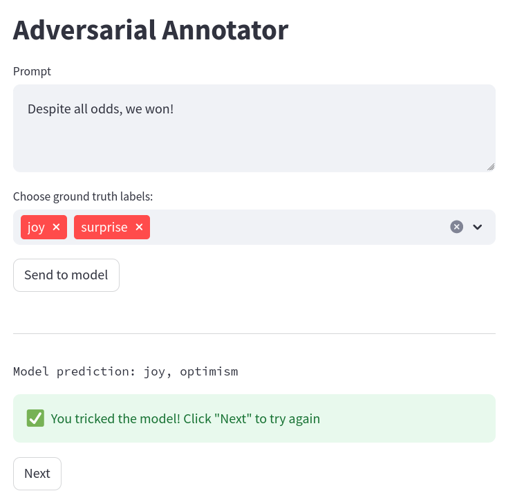

# Adversarial Annotator

This project is an text annotation application for prompting a large language model with potential adversarial prompts on a sentiment classification task, and saving those which trick the model.



## Installation

```bash
git clone https://github.com/sampenders/adversarial-annotator.git
# install dependencies
pip install -r requirements.txt
```

## Usage
Start the web application:
```bash
streamlit run app.py
```
